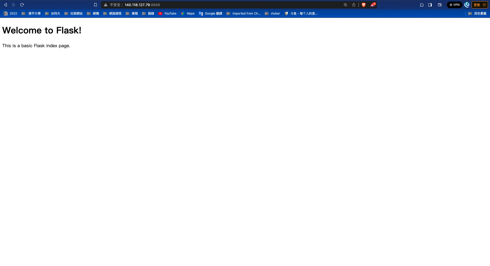
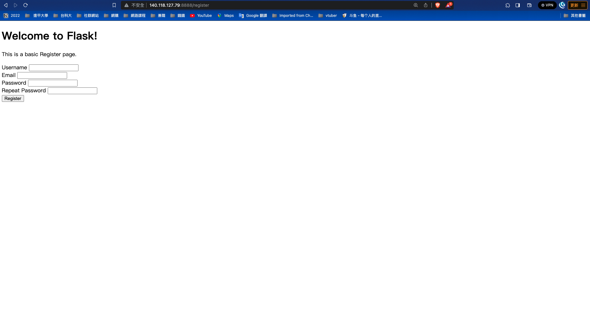
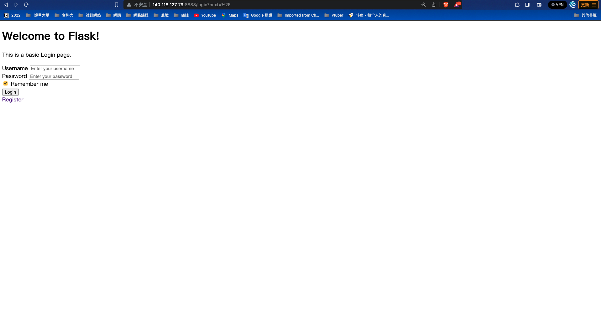

# docker-compose-flask-login


#  製作網頁的起手式-註冊和登入

## 結果圖


  

## 前置作業

### 下載
-   下載docker、docker-compose
-   下載檔案、執行
-   前往<IP>:8888

```bash

    git clone https://github.com/skysora/docker-compose-flask-login
    cd docker-compose-flask-login
    docker-compose up
-
```

### 確認資料夾層級

-   static資料夾放css、js檔案
-   templates資料夾放html檔案
-   auth資料夾放登入註冊相關檔案
-   其他為設定檔案、啟動檔案

```bash

    docker-compose-flask-login/
    ├── web/
    │   ├── static/
    │   │   ├── css/
    │   │   │   ├── style.css
    │   │   │   ├── ...
    │   │   ├── js/
    │   │   │   ├── main.js
    │   │   │   ├── ...
    │   ├── templates/
    │   │   ├── index.html
    │   │   ├── login.html
    │   │   ├── register.html
    │   │   ├── ...
    │   ├── auth/
    │   │   ├── __init__.py
    │   │   ├── forms.py
    │   │   ├── models.py
    │   │   ├── views.py
    │   ├── requirements.txt
    │   ├── gunicorn.conf.py
    │   ├── config.py
    │   ├── app.db
    │   ├── Dockerfile
    ├── docker-compose.yml
    └── ...

```

## 打包後端服務

- 使用docker-compose方便一鍵啟動，並且未來若有擴充模組需求會比較方便
- 以下例子為若未來有需要使用到mysql server docker-compose的寫法，但在本文中不需要db部分所以會註解掉
- web 服務需要的套件會寫在./web/Dockerfile中
- 另外我們使用gunicorn當作部署 Python Web 應用程序的 WSGI HTTP 伺服器，控制檔案寫在./web/gunicorn.conf.py中

### docker-compose
docker-compose.yml
``` docker

    version: '3.0'
    services:
    # db:
    #     image: mariadb:10
    #     container_name: 'db'
    #     environment:
    #       - MYSQL_ROOT_PASSWORD=admin
    #       - MYSQL_USER="root"
    #       - MYSQL_DATABASE:DB
    #       - MYSQL_PASSWORD=admin
    #     ports:
    #       - "5500:3306"
    #     volumes:
    #       - ./sql:/docker-entrypoint-initdb.d
    #       - ./sql:/var/lib/mysql
    #     networks:
    #       - my-network
    #     restart: always
    app:
        build: ./web
        container_name: 'web' 
        # depends_on:
        #       - db
        ports:
            - 8888:80
        volumes:
            - ./web:/web
        networks:
            - my-network
        restart: always
    networks:
    my-network:
        driver: bridge
-
```

### Dockerfile
./web/Dockerfile
```docker

    FROM ubuntu:20.04
    RUN apt-get update && apt-get install -y wget apt-transport-https
    RUN wget https://packages.microsoft.com/config/ubuntu/20.04/packages-microsoft-prod.deb -O packages-microsoft-prod.deb
    RUN dpkg -i packages-microsoft-prod.deb
    RUN rm packages-microsoft-prod.deb
    RUN apt-get update
    RUN apt-get upgrade -y

    RUN apt-get install python3.8-distutils -y
    RUN apt-get install python3.8 -y

    RUN apt-get install wget -y
    RUN wget https://bootstrap.pypa.io/get-pip.py
    RUN python3.8 get-pip.py
    COPY ./requirements.txt /requirements.txt 
    COPY ./packages/flask-login /packages/flask-login 
    RUN pip3 install -r /requirements.txt
    RUN pip3 install ./packages/flask-login
    RUN apt install vim -y


    WORKDIR /web
    CMD gunicorn app:app -c gunicorn.conf.py
-
```
./web/gunicorn.conf.py
```python3

    workers = 5
    worker_class = "gevent"   
    bind = "0.0.0.0:80"

-
```

## Web router 基本設定

### 登入註冊相關route設定(view.py)
- ./web/auth/view.py檔案宣告了所有跟登入註冊相關route
- 我們將相關route依附在auth_blueprint中，在將auth_blueprint註冊到執行app.py中

./web/auth/view.py

``` python3

    from flask import Blueprint
    auth_blueprint = Blueprint('auth', __name__, template_folder='templates')

    @auth_blueprint.route("/")
    @login_required
    def init():
        ...


    @auth_blueprint.route('/login', methods=['GET', 'POST'])
    def login():
        ...


    @auth_blueprint.route("/register",methods=['GET','POST'])
    def register():
        ...
        

    @auth_blueprint.route("/logout",methods=['GET','POST'])
    def logout():
        ...
-
```

### app.py
./web/app.py

```python3

    from flask import Flask
    from config import Config
    from auth.views import auth_blueprint
    app = Flask(__name__)
    app.config.from_object(Config)
    app.register_blueprint(auth_blueprint)

    if __name__ == "__main__":
        app.run()
-
```

## 創建DataBase

- 創建儲存使用者資料的DB，在./web/auth/__init__.py 中宣告，在註冊到app.py中
- 基本設定寫在Config中


### SQLAlchemy DB
./web/auth/__init__.py
```python3

    from flask_sqlalchemy import SQLAlchemy
    db = SQLAlchemy()
-
```
### Config

./web/config.py
```python3

    import os
    from datetime import timedelta

    basedir = os.path.abspath(os.path.dirname(__file__))


    class BaseConfig:  # 基本配置
        SECRET_KEY = os.environ.get('key')
        PERMANENT_SESSION_LIFETIME = timedelta(days=14)


    class Config(BaseConfig):
        # SECRET_KEY
        SECRET_KEY = os.environ.get('SECRET_KEY') or 'A-VERY-LONG-SECTRET-KEY'
        
        SQLALCHEMY_DATABASE_URI = os.environ.get('DATABASE_URL') or 'sqlite:///' + os.path.join(basedir,'app.db')
        SQLALCHEMY_TRACK_MODIFICATIONS= False
-
```


### Model
- 創建使用者資訊到./web/auth/models.py

```python3

    from . import db

    class User(db.Model):
    
        id = db.Column(db.Integer, primary_key=True)
        username = db.Column(db.String(20), unique=True, nullable=False)
        email = db.Column(db.String(120), unique=True,nullable=False)
        password = db.Column(db.String(20), unique=True, nullable=False)
        
        
        def __repr__(self):
            return '<User %r>' % self.username
-
```


### 創建DB指令
- 在app.py中創建(db.create_all())，注意這裡創建完後要註解。

```python3

    from flask import Flask
    from config import Config
    from auth.views import auth_blueprint
    app = Flask(__name__)
    app.config.from_object(Config)
    app.register_blueprint(auth_blueprint)

    # init create db
    with app.app_context(): 
        db.create_all()

    if __name__ == "__main__":
        app.run()
-

```


## 註冊

### 註冊表單
- 創建需要表格到./web/auth/form.py
- ./web/auth/form.py包含欄位名稱以及驗證

```python

    class RegisterForm(FlaskForm):
        
        username = StringField('Username',validators = [DataRequired(),Length(min=3,max=20)])
        email = StringField('Email',validators = [DataRequired(),Email()])
        password = PasswordField('Password',validators=[DataRequired(),Length(min=8,max=20)])
        confirm = PasswordField('Repeat Password',validators=[DataRequired(),EqualTo('password')])
        
        def validate_username(self,username):
            user = User.query.filter_by(username=username.data).first()
            if user:
                raise ValidationError("Username already taken,please chosse anthor username")
            
        def validate_email(self,email):
            user = User.query.filter_by(email=email.data).first()
            if user:
                raise ValidationError("Email already taken,please chosse anthor username")
-
```

### 前端對應表單
- 前端html要對應

```html

    <form method="POST" action="{{ url_for('auth.register') }}">
        {{ form.hidden_tag() }} <!-- 隱藏的 CSRF 欄位 -->
    
        <div class="form-group">
            {{ form.username.label(class="form-control-label") }}
            {{ form.username(class="form-control") }}
            
                <span class="text-danger">{{ error }}</span>
            
        </div>
    
        <div class="form-group">
            {{ form.email.label(class="form-control-label") }}
            {{ form.email(class="form-control") }}
            
                <span class="text-danger">{{ error }}</span>
            
        </div>
    
        <div class="form-group">
            {{ form.password.label(class="form-control-label") }}
            {{ form.password(class="form-control") }}
            
                <span class="text-danger">{{ error }}</span>
            
        </div>
    
        <div class="form-group">
            {{ form.confirm.label(class="form-control-label") }}
            {{ form.confirm(class="form-control") }}
            
                <span class="text-danger">{{ error }}</span>
            
        </div>
    
        <button type="submit" class="btn btn-primary">Register</button>
    </form>
-
```

### 後端接收資料處理
- flask後端，./web/auth/view.py

```python

    @auth_blueprint.route("/register",methods=['GET','POST'])
    def register():
        if current_user.is_authenticated:
            return redirect(url_for('view.azure'))
        form = RegisterForm()
            
            
        if form.validate_on_submit(): 
            username = form.username.data
            email = form.email.data
            password = bctrypt.generate_password_hash(form.password.data)
            user = User(username=username,password=password,email=email)
            db.session.add(user)
            db.session.commit()
            flash("Congrates registeration success",category="success")
            return  redirect(url_for('auth.login'))
        
        return render_template('register.html',form=form)
-
```

## 登入

### 註冊表單
- 創建需要表格到./web/auth/form.py
- ./web/auth/form.py包含欄位名稱

```python

    class LoginForm(FlaskForm):
    
        username = StringField('Username',validators = [DataRequired(),Length(min=3,max=20)])
        password = PasswordField('Password',validators=[DataRequired(),Length(min=8,max=20)])
        remember  = BooleanField('Remember', default=True)
-
```

### 前端對應表單
- 前端html要對應

```html

    <form method="POST" action="{{ url_for('auth.login') }}">
        {{ form.hidden_tag() }}
        <div class="form-group">
            <label for="username">Username</label>
            {{ form.username(class="form-control", placeholder="Enter your username") }}
            
                <span class="text-danger">{{ error }}</span>
            
        </div>
        <div class="form-group">
            <label for="password">Password</label>
            {{ form.password(class="form-control", placeholder="Enter your password") }}
            
                <span class="text-danger">{{ error }}</span>
            
        </div>
        <div class="form-check">
            {{ form.remember(class="form-check-input") }}
            <label class="form-check-label" for="remember">Remember me</label>
        </div>
        <button type="submit" class="btn btn-primary">Login</button>
    </form>
-
```

### 後端接收資料處理
- flask後端，./web/auth/view.py

```python

    @auth_blueprint.route('/login', methods=['GET', 'POST'])
    def login():
        if current_user.is_authenticated:
            return redirect(url_for('view.azure'))
        form = LoginForm()
        if form.validate_on_submit():
            username = form.username.data
            password = form.password.data
            remember = form.remember.data
            user = User.query.filter_by(username=username).first()
            if user and bctrypt.check_password_hash(user.password,password):
                # User exists and password matched
                login_user(user,remember=remember)
                flash('Login success',category="info")
                return redirect(url_for('auth.init'))
            flash('User not exists or password not match',category='danger')
        return render_template('sign-in.html',form=form)
-
```

## 登出

- ./web/auth/view.py，建立登出

```python

    @auth_blueprint.route("/logout",methods=['GET','POST'])
    def logout():
        logout_user()
        flash('Logged out successfully', category='info')
        return redirect(url_for('auth.init'))
-
```
